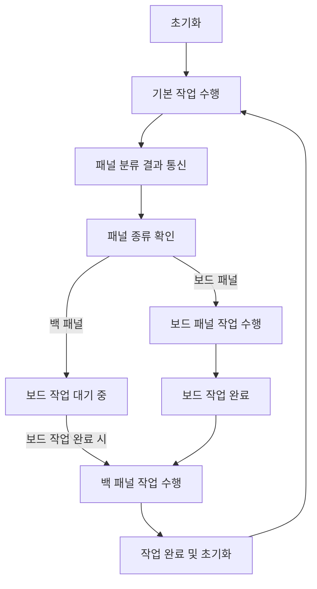

# 스마트 TV 생산 라인 자동화 솔루션

## 프로젝트 개요
스마트 TV 생산 공정의 효율성을 극대화하기 위한 통합 자동화 솔루션입니다
- Intel RealSense D435i 카메라와 YOLOv5 모델을 사용하여 패널의 종류를 실시간으로 분류합니다
- Dobot Magician 로봇 암 및 컨베이어 벨트를 제어하여 패널을 분류 및 이동합니다
- ROS2 기반으로 데이터 통신과 장비 간 동작을 관리하며 RoboDK 시뮬레이션을 통해 작업 환경을 테스트합니다

---

## 시연 영상
[스마트 TV 생산 라인 자동화 시연 영상](https://www.youtube.com/watch?v=IgKFjTNAdM4)

---

## 개발 환경

- **운영 체제**: Ubuntu 20.04 (서버), Raspberry Pi OS (컨베이어 제어)
- **프로그래밍 언어**: Python 3.8
- **주요 하드웨어**:
  - Dobot Magician (로봇)
  - Intel RealSense D435i (카메라)
  - Raspberry Pi (컨베이어 제어)
- **주요 소프트웨어**:
  - YOLOv5 (객체 탐지 모델)
  - ROS2 (로봇 제어 및 데이터 통신)
  - RoboDK (시뮬레이션)

---

## 작업 흐름

* 로봇 암 조립:
  - Dobot Magician이 패널을 흡착하여 조립 구역으로 이동
* 패널 탐지 및 분류:
  - Intel RealSense D435i 카메라가 이미지를 캡처
  - YOLOv5 모델이 패널을 분류
* 컨베이어 벨트 동작:
  - 탐지된 패널 정보를 기반으로 좌우 이동
* RoboDK 시뮬레이션:
  - 패널 종류에 따라 작업을 시뮬레이션
  
---

## 주요 기능

**1. 객체 탐지 및 분류**
- Intel RealSense D435i 카메라를 통해 실시간 이미지 데이터를 캡처합니다
- YOLOv5 모델로 보드 패널과 백 패널을 탐지 및 분류합니다
- 감지된 객체는 컨베이어 벨트와 로봇 암으로 처리됩니다
  
```python
def detect_panel():
    """YOLOv5를 이용한 패널 탐지"""
    ret, frame = camera.read()
    if ret:
        results = model(frame)
        for result in results.xyxy[0]:  # 탐지된 객체
            class_id = int(result[5])
            if class_id == 0:
                return "board"  # 보드 패널
            elif class_id == 1:
                return "back"  # 백 패널
    return None
```

**2. 컨베이어 벨트 제어**
- Raspberry Pi GPIO 핀을 통해 컨베이어 벨트를 제어합니다
- 탐지된 패널 정보를 기반으로 패널을 좌우로 분류하거나 다음 작업 구역으로 이동합니다
  
```python
def move_left():
    """컨베이어 벨트 좌측 이동"""
    GPIO.output(LEFT_BELT, GPIO.HIGH)
    time.sleep(2)
    GPIO.output(LEFT_BELT, GPIO.LOW)
```

**3. Dobot Magician 로봇 암 제어**

- Dobot Magician을 사용하여 패널을 조립 구역으로 옮깁니다
- ROS2 Action Client를 통해 로봇 암의 위치를 제어하고 흡착컵을 사용하여 패널을 픽업합니다
  
```python
def move_board_panel():
    """보드 패널을 컨베이어로 이동"""
    device.move_to(250, 0, 50, 0)
    device.suck(True)
    device.move_to(250, 0, -50, 0)
    device.move_to(150, 100, 50, 0)
    device.suck(False)
```

**4. RoboDK 시뮬레이션**

- RoboDK를 사용하여 작업 흐름을 시뮬레이션하고 실제 로봇 동작을 최적화합니다
- 탐지된 패널 종류에 따라 RoboDK에서 작업 시퀀스를 실행합니다



**핵심 변수 및 상태 관리**
- 패널 유형별 수량을 관리하고, 작업 흐름에 반영

```python
panel_count = {"board": 0, "back": 0}  # 보드 및 백 패널 카운트
simulation_running = False  # 현재 시뮬레이션 상태
current_step = 0  # 작업 단계 관리
```


**패널 데이터 수집 (소켓 통신)**
  
- 서버와의 연결을 통해 패널 정보를 실시간으로 수집하고 처리
- 패널 유형별로 카운트를 증가시키며, 작업 단계에 반영

```python
async def handle_socket():
    """소켓을 통해 패널 카운트 관리."""
    global panel_count
    while True:
        try:
            reader, writer = await asyncio.open_connection('192.168.110.108', 12345)
            while True:
                data = await reader.read(1024)
                panel_type = data.decode('utf-8').strip()
                if panel_type == '5':  # 보드 패널
                    panel_count["board"] += 1
                elif panel_type == '3':  # 백 패널
                    panel_count["back"] += 1
                print(f"Panel Count: {panel_count}")
                await asyncio.sleep(0.1)
        except Exception as e:
            print(f"Socket error: {e}")
            await asyncio.sleep(5)
```

**작업 상태 기반 작업 흐름**
  
- 작업은 단계별로 실행되며, 보드와 백 패널의 우선순위에 따라 스케줄링됨

```python
async def simulation_task():
    """시뮬레이션 상태와 패널 개수를 기반으로 작업 수행."""
    global simulation_running, panel_count, current_step
    
    while True:
        if not simulation_running:
            if current_step == 0:  # 초기 준비 단계
                await asyncio.to_thread(run_preparation)
                current_step = 1  # 다음 단계로 이동
                
            elif current_step == 1 and panel_count["board"] > 0:  # 보드 패널 작업
                panel_count["board"] -= 1
                await asyncio.to_thread(run_board_panel_task)
                current_step = 2  # 다음 단계로 이동
                
            elif current_step == 2 and panel_count["back"] > 0:  # 백 패널 작업
                panel_count["back"] -= 1
                await asyncio.to_thread(run_back_panel_task)
                current_step = 0  # 초기 단계로 복귀
                
            else:  # 대기 상태
                await asyncio.sleep(0.1)
        else:
            await asyncio.sleep(0.1)
```

**작업 단계별 세부 구현**
  
- 각 작업은 RoboDK API를 통해 시뮬레이션 및 로봇 제어와 통합

```python
def run_preparation():
    """준비 작업 실행."""
    time.sleep(5)  # 리셋 대기
    job1(process_count)  # 초기 설정
    job2()
    job3(process_count)

def run_board_panel_task():
    """보드판넬 작업 실행."""
    job11()  # Rack 이동
    job12()  # TVFrame 준비
    job13()  # Conveyor1 작동
    job16(process_count)  # 조립 작업 완료

def run_back_panel_task():
    """백판넬 작업 실행."""
    job17()  # BackPanel 준비
    job20()  # 조립 작업
    job21(process_count)  # Foam 추가 작업
    job23()  # 작업 완료
```

**메인 실행**
  
- 비동기 루프를 활용하여 소켓 통신과 작업 흐름을 병렬로 관리

```python
async def main():
    """메인 비동기 루프."""
    socket_task = asyncio.create_task(handle_socket())
    simulation_task_coroutine = asyncio.create_task(simulation_task())
    await asyncio.gather(socket_task, simulation_task_coroutine)

# 비동기 루프 실행
asyncio.run(main())
```

**5. ROS2 기반 통신 및 동기화**

- ROS2를 통해 장치 간 데이터를 송수신하고 동작을 제어합니다
- YOLOv5의 탐지 결과를 ROS2 토픽으로 퍼블리시하며, Dobot Magician 및 컨베이어 벨트 제어를 동기화합니다
  
```python
self.image_publisher = self.create_publisher(Image, 'detection_image', 10)
self.timer = self.create_timer(0.1, self.timer_callback)
```


