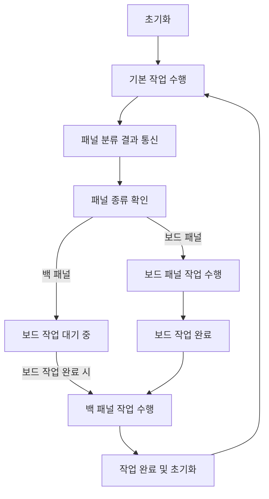

# 스마트 TV 생산 라인 자동화 솔루션

## 프로젝트 개요
스마트 TV 생산 공정의 효율성을 극대화하기 위한 통합 자동화 솔루션입니다
- Intel RealSense D435i 카메라와 YOLOv5 모델을 사용하여 패널의 종류를 실시간으로 분류합니다
- Dobot Magician 로봇 암 및 컨베이어 벨트를 제어하여 패널을 분류 및 이동합니다
- ROS2 기반으로 데이터 통신과 장비 간 동작을 관리하며 RoboDK 시뮬레이션을 통해 작업 환경을 테스트합니다

---

## 시연 영상
[스마트 TV 생산 라인 자동화 시연 영상](https://www.youtube.com/watch?v=IgKFjTNAdM4)

---

## 개발 환경

- **운영 체제**: Ubuntu 20.04 (서버), Raspberry Pi OS (컨베이어 제어)
- **프로그래밍 언어**: Python 3.8
- **주요 하드웨어**:
  - Dobot Magician (로봇)
  - Intel RealSense D435i (카메라)
  - Raspberry Pi (컨베이어 제어)
- **주요 소프트웨어**:
  - YOLOv5 (객체 탐지 모델)
  - ROS2 (로봇 제어 및 데이터 통신)
  - RoboDK (시뮬레이션)

---

## 작업 흐름

* 로봇 암 조립:
  - Dobot Magician이 패널을 흡착하여 조립 구역으로 이동
* 패널 탐지 및 분류:
  - Intel RealSense D435i 카메라가 이미지를 캡처
  - YOLOv5 모델이 패널을 분류
* 컨베이어 벨트 동작:
  - 탐지된 패널 정보를 기반으로 좌우 이동
* RoboDK 시뮬레이션:
  - 패널 종류에 따라 작업을 시뮬레이션
  
---

## 주요 기능

### 객체 탐지 및 분류
- Intel RealSense D435i 카메라를 통해 실시간 이미지 데이터를 캡처합니다
- YOLOv5 모델로 보드 패널과 백 패널을 탐지 및 분류합니다
- 감지된 객체는 컨베이어 벨트와 로봇 암으로 처리됩니다
  
```python
def detect_panel():
    """YOLOv5를 이용한 패널 탐지"""
    ret, frame = camera.read()
    if ret:
        results = model(frame)
        for result in results.xyxy[0]:  # 탐지된 객체
            class_id = int(result[5])
            if class_id == 0:
                return "board"  # 보드 패널
            elif class_id == 1:
                return "back"  # 백 패널
    return None
```

### 컨베이어 벨트 제어

- Raspberry Pi GPIO 핀을 통해 컨베이어 벨트를 제어합니다
- 탐지된 패널 정보를 기반으로 패널을 좌우로 분류하거나 다음 작업 구역으로 이동합니다

**컨베이어 벨트의 구조 및 역할**

1. 스텝 모터 (Stepper Motor)
- 컨베이어 벨트의 방향과 속도를 제어합니다.
- 모터는 GPIO 핀을 통해 신호를 받아 작동하며, 속도와 가속도는 코드에서 설정 가능합니다.
- 방향:
  - 1 (CW): 시계 방향으로 이동.
  - -1 (CCW): 반시계 방향으로 이동.
- 속도:
  - 초기 속도(INITIAL_SPEED)에서 시작하여 목표 속도(TARGET_SPEED)까지 점진적으로 가속/감속합니다.
    
2. 서보 모터 (Servo Motor)
- 패널의 위치를 조정하거나 추가적인 분류 작업을 수행합니다.
- 각도는 90도(최소), 135도(초기 위치), 180도(최대)로 설정 가능합니다.

**컨베이어 벨트 제어 코드 구현**

1. 스텝 모터 동작
- 스텝 모터는 컨베이어 벨트의 움직임을 담당하며, 방향, 속도, 가속/감속을 설정할 수 있습니다.

```python
class StepperMotor:
    def __init__(self, gpio_manager):
        self.gpio = gpio_manager
        self.speed = Config.INITIAL_SPEED  # 초기 속도
        self.target_speed = Config.TARGET_SPEED  # 목표 속도
        self.ratio = Config.ACCELERATION_RATIO  # 가속 비율
        self.is_running = False  # 동작 상태
        self.direction = 0  # 1: CW, -1: CCW, 0: 정지
        self.is_accelerating = False

        # GPIO 핀 설정
        self.gpio.setup_pin(Config.DIR_PIN, "dir")  # 방향 제어 핀
        self.gpio.setup_pin(Config.STEP_PIN, "step")  # 스텝 제어 핀
        self.gpio.setup_pin(Config.ENABLE_PIN, "enable")  # 활성화 핀

    def set_direction(self, direction):
        """모터 방향 설정"""
        self.direction = direction
        self.gpio.set_value(Config.DIR_PIN, 0 if direction == 1 else 1)

    def start(self):
        """모터 시작"""
        if not self.is_running:
            self.is_running = True
            threading.Thread(target=self._run).start()

    def stop(self):
        """모터 정지"""
        self.direction = 0
        self.is_accelerating = False

    def _run(self):
        """스텝 모터의 동작 루프"""
        self.gpio.set_value(Config.ENABLE_PIN, 0)  # 모터 활성화
        while self.is_running:
            if self.is_accelerating and self.speed > self.target_speed:
                self.speed -= self.ratio  # 가속
            elif not self.is_accelerating and self.speed < Config.INITIAL_SPEED:
                self.speed += self.ratio  # 감속

            # 모터 정지 조건 확인
            if self.direction == 0 and self.speed >= Config.INITIAL_SPEED:
                self.is_running = False

            # 스텝 신호 생성
            self.gpio.set_value(Config.STEP_PIN, 1)
            time.sleep(self.speed)
            self.gpio.set_value(Config.STEP_PIN, 0)
            time.sleep(self.speed)

    def disable(self):
        """모터 비활성화"""
        self.gpio.set_value(Config.ENABLE_PIN, 1)
```

2. 서보 모터 동작
- 서보 모터는 패널 위치 조정을 위해 사용되며, 각도를 조정하여 다양한 동작을 수행합니다.

```python
class ServoMotor:
    def __init__(self, gpio_manager):
        self.gpio = gpio_manager
        self.gpio.setup_pin(Config.SERVO_PIN, "servo")

    def set_angle(self, angle):
        """서보 각도 설정"""
        pulse_width = (angle / 270) * (0.0025 - 0.0005) + 0.0005
        for _ in range(10):  # 안정적인 위치 이동
            self.gpio.set_value(Config.SERVO_PIN, 1)
            time.sleep(pulse_width)
            self.gpio.set_value(Config.SERVO_PIN, 0)
            time.sleep(0.02 - pulse_width)
```

**컨베이어 벨트의 주요 명령 처리**
- 컨베이어 벨트 동작은 서버로부터 수신한 명령에 따라 수행됩니다.

- 명령 '1'을 수신하면 컨베이어 벨트가 시계 방향으로 움직이기 시작합니다.
- 명령 '2'을 수신하면 모터를 정지합니다.
- 명령 '3', '5'을 수신하면 서보 모터를 움직여 패널을 분류합니다.

```python
if command == '1':  # 모터 시계 방향
    if not self.motor_running:
        print("Starting motor CW")
        self.stepper_motor.set_direction(1)
        self.stepper_motor.start()
        self.motor_running = True
    else:
        print("Stopping motor CW")
        self.stepper_motor.stop()
        self.motor_running = False
    self.print_status()
elif command == '2':  # 모터 정지
    print("Stopping motor immediately")
    self.stepper_motor.stop()
    self.motor_running = False
    self.print_status()
elif command == '3':  # 서보 모터 180도 후 초기화
    print("Moving servo to 180 degrees")
    self.servo_motor.set_angle(Config.SERVO_MAX_POSITION)
    time.sleep(6)  # 대기
    print("Resetting servo to initial position")
    self.servo_motor.set_angle(Config.SERVO_INITIAL_POSITION)
    self.print_status()
 elif command == '5':  # 서보 모터 90도 후 초기화
    print("Moving servo to 90 degrees")
    self.servo_motor.set_angle(Config.SERVO_MIN_POSITION)
    time.sleep(6)  # 대기
    print("Resetting servo to initial position")
    self.servo_motor.set_angle(Config.SERVO_INITIAL_POSITION)
    self.print_status()
```

### Dobot Magician 로봇 암 제어

- Dobot Magician을 사용하여 패널을 조립 구역으로 옮깁니다
- ROS2 Action Client를 통해 로봇 암의 위치를 제어하고 흡착컵을 사용하여 패널을 픽업합니다
  
**흡착컵 동작 구현**

- 흡착컵은 패널을 잡고 놓는 데 사용됩니다. 
- set_suction 메서드는 흡착 활성화 또는 비활성화를 수행합니다.
- 흡착 상태를 제어하기 위해 state 값이 "on"이면 흡착컵을 활성화하고, "off"면 비활성화합니다.

```python
def set_suction(self, enable: bool):
    """
    흡착컵 제어 명령을 보냄
    :param enable: 흡착 활성화(True) 또는 비활성화(False)
    """
    req = SuctionCupControl.Request()
    req.enable_suction = enable

    self.get_logger().info(f'Setting suction: {"ON" if enable else "OFF"}')
    while not self.suction_service_client.wait_for_service(timeout_sec=1.0):
        self.get_logger().warn('/dobot_suction_cup_service not available, waiting...')

    future = self.suction_service_client.call_async(req)
    future.add_done_callback(self.suction_response_callback)
```
**PTP 이동 명령 구현**

- send_ptp_goal 메서드는 두봇이 지정된 위치로 이동하도록 합니다.
- motion_type은 이동 유형을 결정하며, position은 목표 좌표입니다.

```python
def send_ptp_goal(self, motion_type, target_pose):
    """
    PTP(Point-to-Point) 이동 명령을 보냄
    :param motion_type: 이동 유형 (1: PTP Motion)
    :param target_pose: 목표 위치 [x, y, z, r]
    """
    goal_msg = PointToPoint.Goal()
    goal_msg.motion_type = motion_type
    goal_msg.target_pose = target_pose
    goal_msg.velocity_ratio = Config.PTP_DEFAULT_VELOCITY
    goal_msg.acceleration_ratio = Config.PTP_DEFAULT_ACCELERATION

    self.get_logger().info(f'Sending PTP goal: {goal_msg}')
    self.ptp_action_client.wait_for_server()
    future = self.ptp_action_client.send_goal_async(goal_msg)
    future.add_done_callback(self.ptp_goal_response_callback)
```

**Homing 서비스 호출**

- 두봇이 작업을 시작하기 전 초기 위치로 복귀하도록 execute_homing 메서드를 호출합니다.

```python
def execute_homing(self):
    """
    Homing 서비스 호출
    """
    req = ExecuteHomingProcedure.Request()
    self.get_logger().info('Waiting for Homing service...')
    while not self.homing_service_client.wait_for_service(timeout_sec=1.0):
        self.get_logger().warn('/dobot_homing_service not available, waiting...')

    self.get_logger().info('Calling Homing service...')
    future = self.homing_service_client.call_async(req)
    rclpy.spin_until_future_complete(self, future)

    if future.result() is not None:
        self.get_logger().info(f'Homing service completed successfully: {future.result()}')
    else:
        self.get_logger().error('Homing service failed.')
```

**JSON 작업 실행**
- 작업을 JSON 파일에서 저장하고 읽어 순차적으로 실행합니다.
- 작업 단계는 이동(move)과 흡착컵 제어(gripper)로 구성됩니다.

```python
def execute_task(dobot_controller, task):
    """
    단일 작업(Task)을 실행
    :param dobot_controller: DobotController 객체
    :param task: 실행할 작업(Task) 데이터
    """
    dobot_controller.get_logger().info(f"Starting Task: {task['name']}")
    for step in task["steps"]:
        if step["event"] == "move":
            dobot_controller.send_ptp_goal(
                motion_type=step["motion_type"],
                target_pose=step["position"]
            )
            time.sleep(Config.MOVE_WAIT_TIME)
        elif step["event"] == "gripper":
            dobot_controller.set_suction(step["state"] == "on")
            time.sleep(Config.SUCTION_WAIT_TIME)
```

### RoboDK 시뮬레이션

- RoboDK를 사용하여 작업 흐름을 시뮬레이션하고 실제 로봇 동작을 최적화합니다
- 탐지된 패널 종류에 따라 RoboDK에서 작업 시퀀스를 실행합니다



**핵심 변수 및 상태 관리**
- 패널 유형별 수량을 관리하고, 작업 흐름에 반영

```python
panel_count = {"board": 0, "back": 0}  # 보드 및 백 패널 카운트
simulation_running = False  # 현재 시뮬레이션 상태
current_step = 0  # 작업 단계 관리
```


**패널 데이터 수집 (소켓 통신)**
  
- 서버와의 연결을 통해 패널 정보를 실시간으로 수집하고 처리
- 패널 유형별로 카운트를 증가시키며, 작업 단계에 반영

```python
async def handle_socket():
    """소켓을 통해 패널 카운트 관리."""
    global panel_count
    while True:
        try:
            reader, writer = await asyncio.open_connection('192.168.110.108', 12345)
            while True:
                data = await reader.read(1024)
                panel_type = data.decode('utf-8').strip()
                if panel_type == '5':  # 보드 패널
                    panel_count["board"] += 1
                elif panel_type == '3':  # 백 패널
                    panel_count["back"] += 1
                print(f"Panel Count: {panel_count}")
                await asyncio.sleep(0.1)
        except Exception as e:
            print(f"Socket error: {e}")
            await asyncio.sleep(5)
```

**작업 상태 기반 작업 흐름**
  
- 작업은 단계별로 실행되며, 보드와 백 패널의 우선순위에 따라 스케줄링됨

```python
async def simulation_task():
    """시뮬레이션 상태와 패널 개수를 기반으로 작업 수행."""
    global simulation_running, panel_count, current_step
    
    while True:
        if not simulation_running:
            if current_step == 0:  # 초기 준비 단계
                await asyncio.to_thread(run_preparation)
                current_step = 1  # 다음 단계로 이동
                
            elif current_step == 1 and panel_count["board"] > 0:  # 보드 패널 작업
                panel_count["board"] -= 1
                await asyncio.to_thread(run_board_panel_task)
                current_step = 2  # 다음 단계로 이동
                
            elif current_step == 2 and panel_count["back"] > 0:  # 백 패널 작업
                panel_count["back"] -= 1
                await asyncio.to_thread(run_back_panel_task)
                current_step = 0  # 초기 단계로 복귀
                
            else:  # 대기 상태
                await asyncio.sleep(0.1)
        else:
            await asyncio.sleep(0.1)
```

**작업 단계별 세부 구현**
  
- 각 작업은 RoboDK API를 통해 시뮬레이션 및 로봇 제어와 통합

```python
def run_preparation():
    """준비 작업 실행."""
    time.sleep(5)  # 리셋 대기
    job1(process_count)  # 초기 설정
    job2()
    job3(process_count)

def run_board_panel_task():
    """보드판넬 작업 실행."""
    job11()  # Rack 이동
    job12()  # TVFrame 준비
    job13()  # Conveyor1 작동
    job16(process_count)  # 조립 작업 완료

def run_back_panel_task():
    """백판넬 작업 실행."""
    job17()  # BackPanel 준비
    job20()  # 조립 작업
    job21(process_count)  # Foam 추가 작업
    job23()  # 작업 완료
```

**메인 실행**
  
- 비동기 루프를 활용하여 소켓 통신과 작업 흐름을 병렬로 관리

```python
async def main():
    """메인 비동기 루프."""
    socket_task = asyncio.create_task(handle_socket())
    simulation_task_coroutine = asyncio.create_task(simulation_task())
    await asyncio.gather(socket_task, simulation_task_coroutine)

# 비동기 루프 실행
asyncio.run(main())
```

### ROS2 기반 통신 및 동기화

- ROS2를 통해 장치 간 데이터를 송수신하고 동작을 제어합니다
- YOLOv5의 탐지 결과를 ROS2 토픽으로 퍼블리시하며, Dobot Magician 및 컨베이어 벨트 제어를 동기화합니다
  
```python
self.image_publisher = self.create_publisher(Image, 'detection_image', 10)
self.timer = self.create_timer(0.1, self.timer_callback)
```


